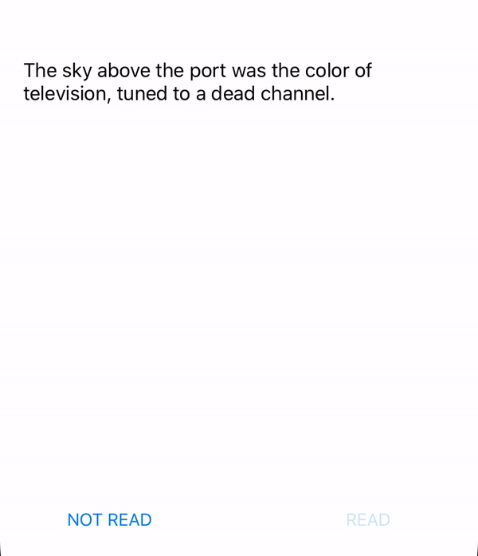

# HidableStepper
StrithroughLabel provides a easy way to animates strikethrough effect in a label using bezier path animation.



#### Version 0.0.1
- **April, 2020** - HidableStepper 🥳

## Installation
###  CocoaPods

```ruby
pod 'StrikethroughLabel'
```

###  Manually
You can directly copy and paste the file `StrikethroughLabel` to your project.

## Usage

- Use `strikeThroughText()` to start a new animation with any duration and line color you want.

- Use `hideStrikeTextLayer` to hides the line.

- Use `showStrikeTextLayer` to present a hidden line again (calls strikeThroughText with duration = 0.0)

## Bugs and Feedback
For bugs, questions and discussions please use the [Github Issues](https://github.com/chrsp/StrikethroughLabel/issues).


